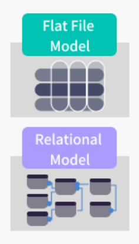

# Database Report
### By Shahad Al Harthy

## 1. Flat File Systems vs. Relational Databases

| Aspect           | Flat File Systems                          | Relational Databases                         |
|------------------|--------------------------------------------|----------------------------------------------|
| **Structure**     | Simple files like CSV, no built-in structure | Tables with defined schema (rows & columns)  |
| **Data Redundancy**| High redundancy, repeated data             | Low redundancy through normalization         |
| **Relationships** | No inherent relationships                  | Supports foreign keys and joins              |
| **Example Usage** | Log files, spreadsheets                    | Student records, financial systems           |
| **Drawbacks**     | Difficult to maintain, not scalable        | More complex setup, needs DBMS               |

---

## 2. DBMS Advantages – Mind Map

**Mind Map:** 

**Key Advantages:**
-  **Security** – Controls user access and protects data
-  **Integrity** – Enforces data accuracy and consistency
-  **Backup** – Supports automatic and manual backups
-  **Redundancy** – Minimizes duplication through normalization
-  **Concurrency** – Multiple users can access data simultaneously
-  **Data Sharing** – Enables controlled data sharing between users/applications

---

##  3. Roles in a Database System

### • System Analyst
Gathers business requirements and defines what the database system should do.

### • Database Designer
Creates the conceptual and logical design of the database schema.

### • Database Developer
Implements the schema, queries, and procedures for interacting with the database.

### • Database Administrator (DBA)
Manages database performance, backups, security, and recovery.

### • Application Developer
Builds front-end or back-end applications that connect to the database.

### • BI Developer
Develops dashboards, reports, and tools for business data analysis.

---

## 4. Types of Databases

### Relational vs. Non-Relational
- **Relational**: Structured data, uses SQL (e.g., MySQL, PostgreSQL)
- **Non-Relational (NoSQL)**: Flexible schema, handles unstructured data
  - *Examples*: MongoDB (document), Cassandra (column-based)

### Centralized vs. Distributed vs. Cloud

| Type         | Description                                  | Example             |
|--------------|----------------------------------------------|---------------------|
| Centralized  | All data in one location                     | Legacy systems      |
| Distributed  | Data distributed across nodes/locations      | Google Bigtable     |
| Cloud        | Managed database service in the cloud       | Amazon RDS, Azure SQL|

*Visual suggestion:* A diagram showing the difference in architecture.

---

## 5. Cloud Storage and Databases

### What is Cloud Storage?
Cloud storage is a service that allows data to be saved on remote servers and accessed over the internet.

### How It Supports Databases:
- Stores backups
- Enables remote data access
- Supports scalable infrastructure for databases

### Advantages of Cloud-Based Databases
- On-demand scalability
- Easy backup and recovery
- Cost-effective (pay-as-you-go)
- High availability

### Disadvantages
- Data privacy/security concerns
- Vendor lock-in
- Dependency on internet connectivity

