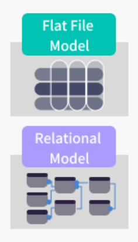
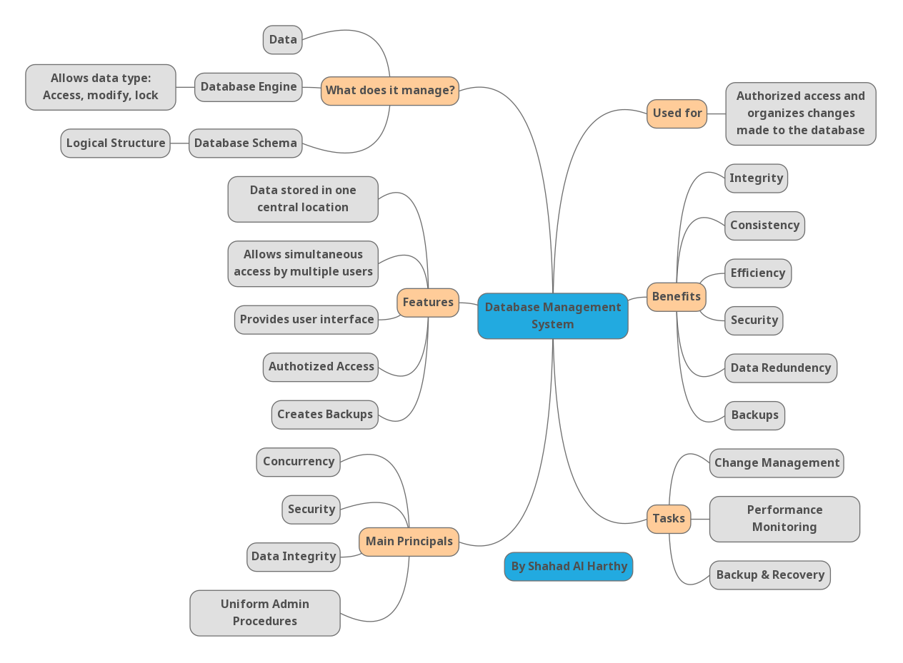

# Database Report
### By Shahad Al Harthy

## 1. Flat File Systems vs. Relational Databases

| Aspect           | Flat File Systems                          | Relational Databases                         |
|------------------|--------------------------------------------|----------------------------------------------|
| **Structure**     | No inbuilt structure Simple files e.g. CSV| Tables with defined schema (rows & columns)  |
| **Data Redundancy**| Redundancy of information: redundancy, duplicate information        | Low redundancy via normalization         |
| **Relationships** | No inherent relationships                  | Supports foreign keys and joins              |
| **Example Usage** | Log files, spreadsheets                    | Student records, financial systems           |
| **Drawbacks**     | Difficult to maintain, unscalable        | More complex setup, needs DBMS               |

---

## 2. DBMS Advantages – Mind Map

**Mind Map:** 

**Key Advantages:**
-  **Security** – Controls user access and protects data
-  **Integrity** – Enforces data accuracy and consistency
-  **Backup** – Supports automatic and manual backups
-  **Redundancy** – Minimizes duplication through normalization
-  **Concurrency** – Multiple users are allowed to access data at once
-  **Data Sharing** – Enables controlled data sharing between users/applications

---

##  3. Roles in a Database System

### • System Analyst
Find out business needs and decides upon what the database system is to perform.

### • Database Designer
Generates the theoretical and logical structure of database structure.

### • Database Developer
Applies the schema, queries and procedures of how to access the database.

### • Database Administrator (DBA)
Manages database performance, backups, security, and recovery.

### • Application Developer
Creates the front-end or back-end programs linking them to the database.

### • BI Developer
Develops dashboards, reports, and tools for business data analysis.

---

## 4. Types of Databases

### Relational vs. Non-Relational
- **Relational**: Structured data, uses SQL (e.g., MySQL, PostgreSQL)
- **Non-Relational (NoSQL)**: Flexible schema, handles unstructured data
  - *Examples*: MongoDB (document), Cassandra (column-based)

### Centralized vs. Distributed vs. Cloud

| Type         | Description                                  | Example             |
|--------------|----------------------------------------------|---------------------|
| Centralized  | All data in one location                     | Legacy systems      |
| Distributed  | Data distributed across nodes/locations      | Google Bigtable     |
| Cloud        | Managed database service in the cloud       | Amazon RDS, Azure SQL|

---

## 5. Cloud Storage and Databases

### What is Cloud Storage?
Cloud storage is a service provided where the data will be stored on remote servers that can be accessed through the internet.

### How It Supports Databases:
- Stores backups
- Enables remote data access
- Supports scalable infrastructure for databases

### Advantages of Cloud-Based Databases
- On-demand scalability
- Easy backup and recovery
- Cost-effective (pay-as-you-go)
- High availability

### Disadvantages
- Data privacy/security concerns
- Vendor lock-in
- Internet dependency
---
### References
[https://www.integrate.io/blog/database-schema-examples/]
[https://www.ibm.com/docs/en/zos-basic-skills?topic=zos-what-is-database-management-system]
[https://app.mindmup.com/map/_free/2025/07/bb7556906e0011f0a1fc1359daa10ffa]
[https://www.geeksforgeeks.org/dbms/dbms/]
